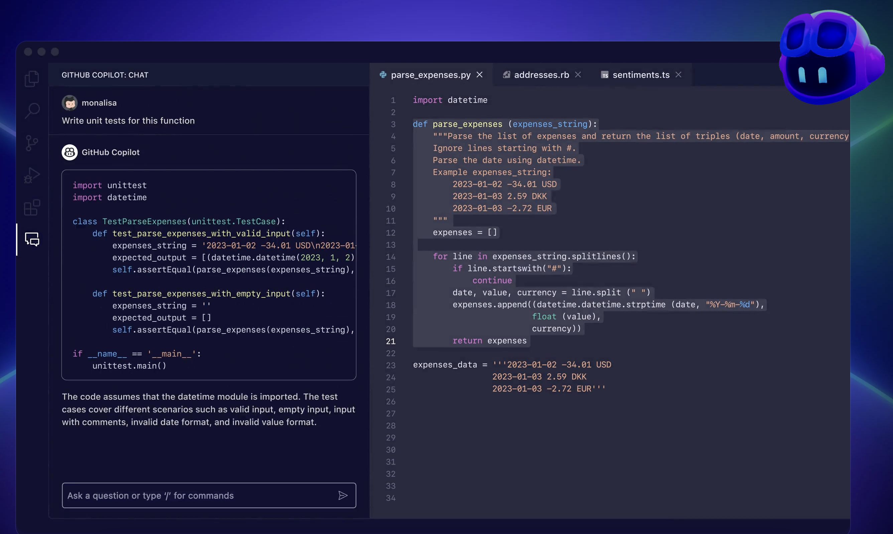

# GitHubCopilotWorkShop 

本实验是给到 GitHub Copilot Workshop 的线上练习，通过该练习，我们可以掌握 GitHub Copilot, GitHub Copilot Chat ,以及 GitHub Copilot 管理的相关功能。

## **📝环境要求**

在该 Workshop 中，建议采用 GitHub Codespaces 来完成所有内容, 已经配置

1. .NET 8
2. OpenJDK 21.0.4
3. NodeJS 20.16.0
4. Python 3.10.12(conda activate pydev)
5. .NET / Java / Python 的 Notebook 环境

## **👩🏻‍🔬Lab**

随堂练习，通过该练习，我们可以巩固不同的知识点

- **🧪lab1** GitHub Copilot 十大神技  👉[点击进入](./lab/01.Top10Skills.md)
- **🧪lab2** 通过 GitHub Copilot Chat，用 .NET 创建一个用户系统.或许 .NET 不是您最熟悉的，但在 GitHub Copilot 的辅助下，您可以快速创建一个全新的项目 👉[点击进入](./lab/02.chat.md)
- **🧪lab3** GitHub Copilot Chat Agent 功能强大，我们可以通过它快速创建一个项目 👉[点击进入](./lab/03.agents.md)
- **🧪lab4** 通过 GitHub Copilot Metric API 快速了解 GitHub Copilot 的使用情况 👉[点击进入](./lab/04.metric.md)

## **🛠️HOL**

动手实验，结合不同知识点，完成练习

- **👨🏻‍💻01** 企业场景的思考 👉[点击进入](./hol/01/README.md)
- **👨🏻‍💻02** 如何快速构建应用场景 👉[点击进入](./hol/02/README.md)
