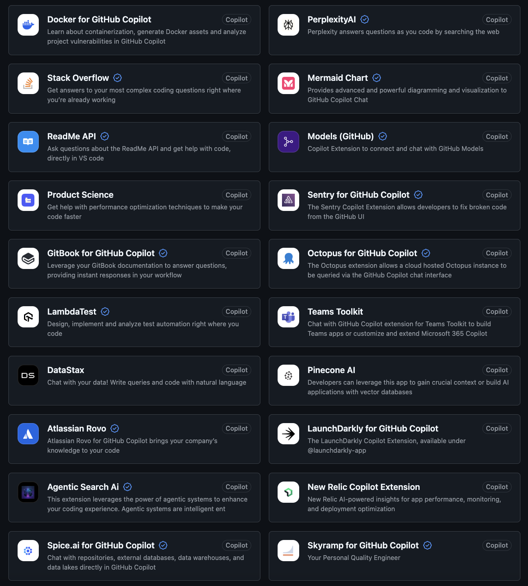
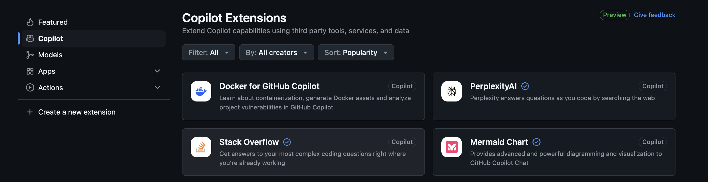
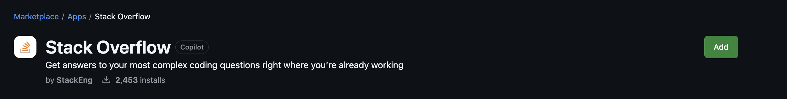
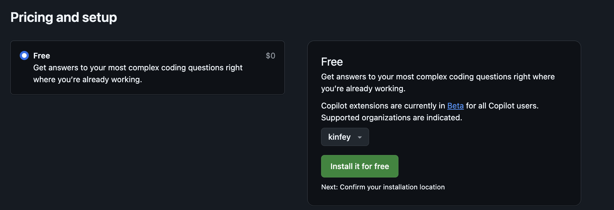
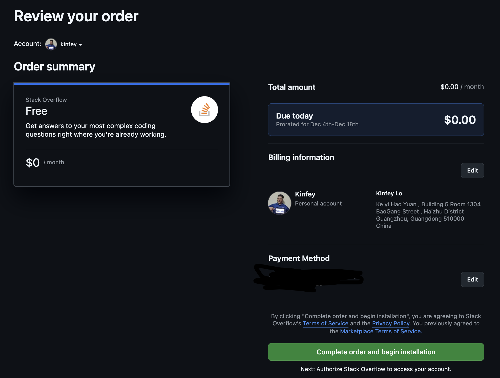
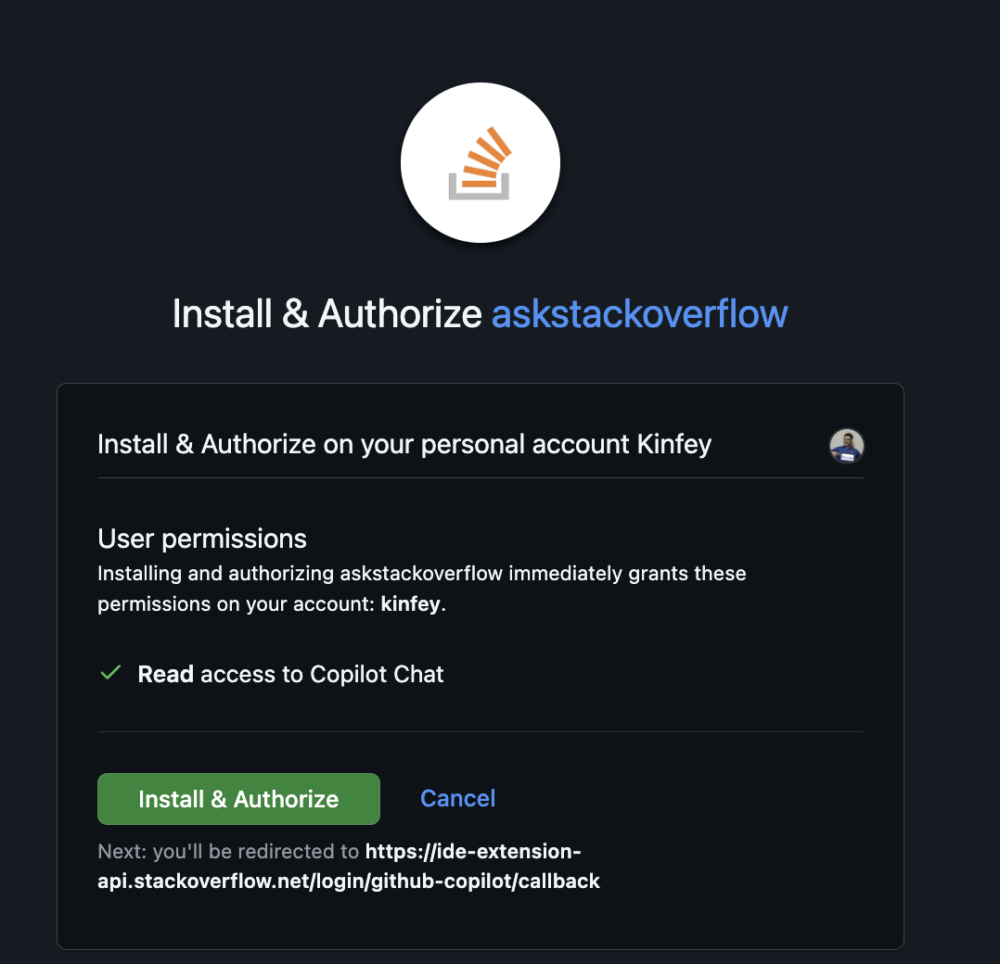
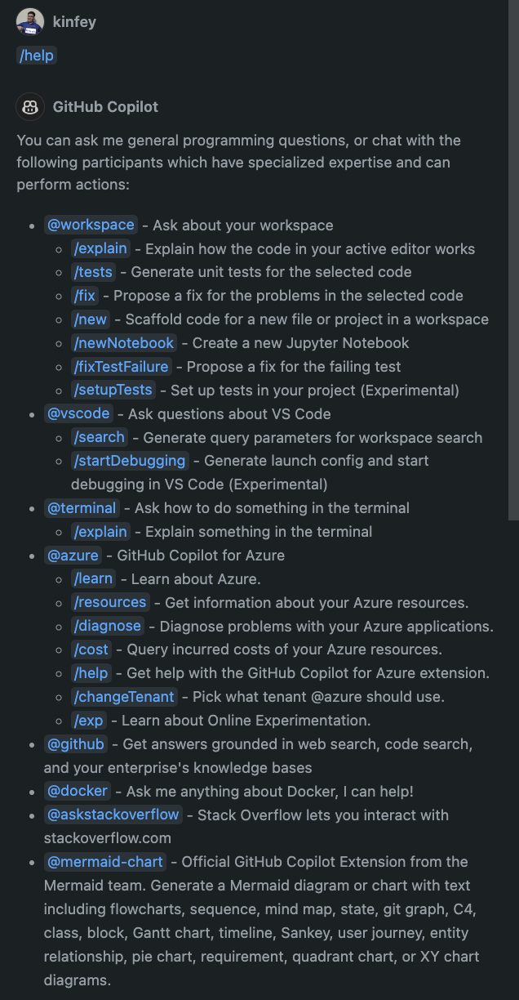
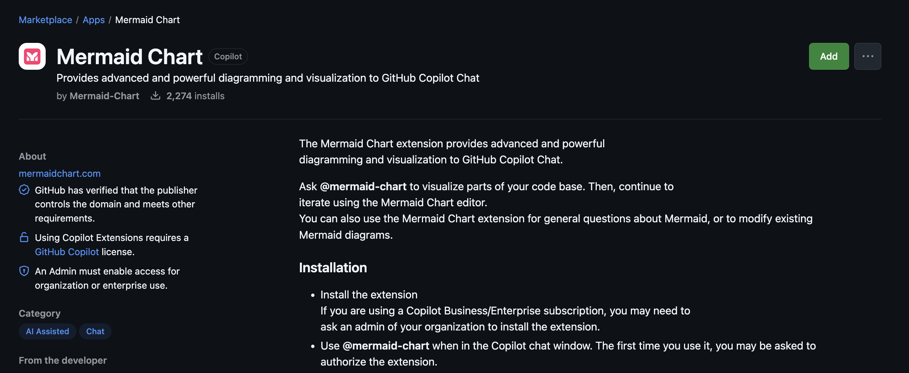

# **通过 GitHub Copilot Agent 快速了解您的开源项目**

**时间** 20min

GitHub Copilot 提供了基于不同功能的第三方 Agent，您可以基于不同的场景进行应用。[点击进入](https://github.com/marketplace?type=apps&copilot_app=true)

如您过往使用的 Stack Overflow 您可以直接添加到您的 GitHub Copilot Chat 中，具体步骤如下

1. 选择 Stack Overflow

2. 选择 Add 按钮进行添加

选择添加后，选择 Install it for free 

确认相关信息后，进行远程安装

验证安装

**注意** 您需要重启您的 VS Code，才能使用

3. 重启后，在 Copilot Chat 界面，输入 /help, 您可以了解关于 Stackoverflow Agent 的使用方式

### **练习**

尝试安装 Mermaid Chart 控件

并基于该控件分析您的代码，并生成 UML

