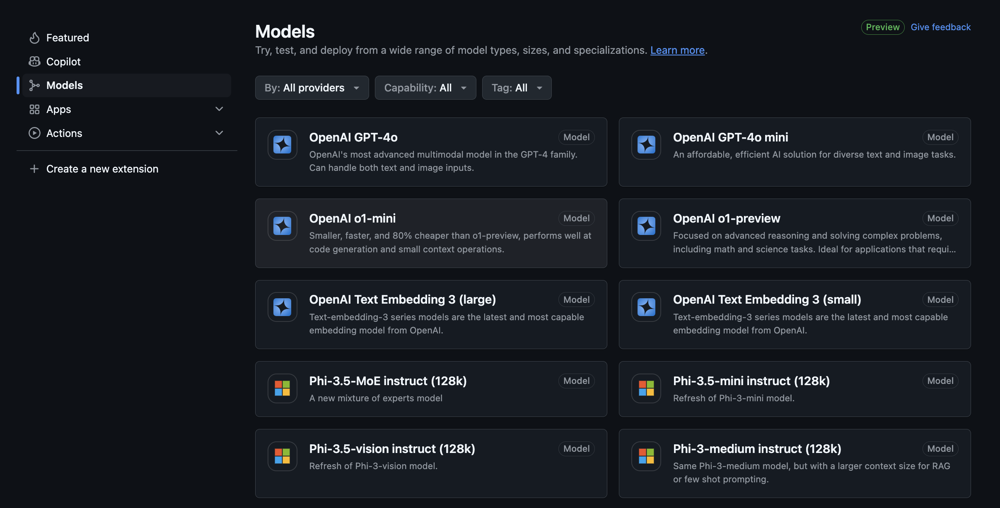
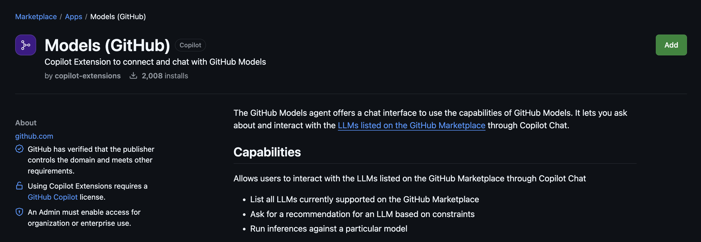

# **利用 GitHub Models 和 GitHub Copilot 创建您的第一个聊天应用**

**时间** 40min

GitHub 提供了 GitHub Models 给到开发团队完成不同的模型测试，您可以通过[进入该链接](https://gh.io/models)

我们希望构建一个聊天应用可以结合 GitHub Models 完成，一些提示

1. 用 GitHub Copilot Chat 协助完成 Chat 界面的构建

2. 利用 Models (GitHub) Agents 协助您完成模型访问的设定

3. 通过 markdown 写一个需求，结合 @workspace 来配合完成相关的工作。